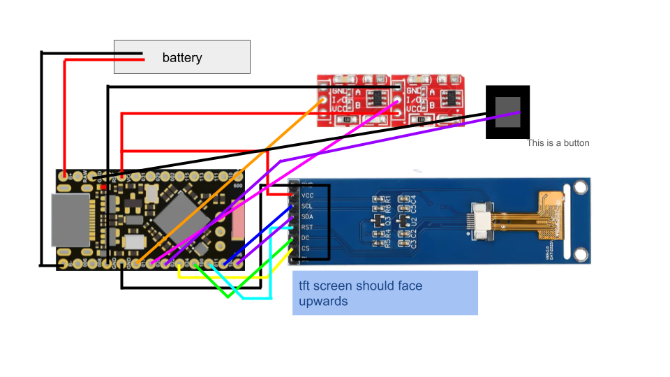
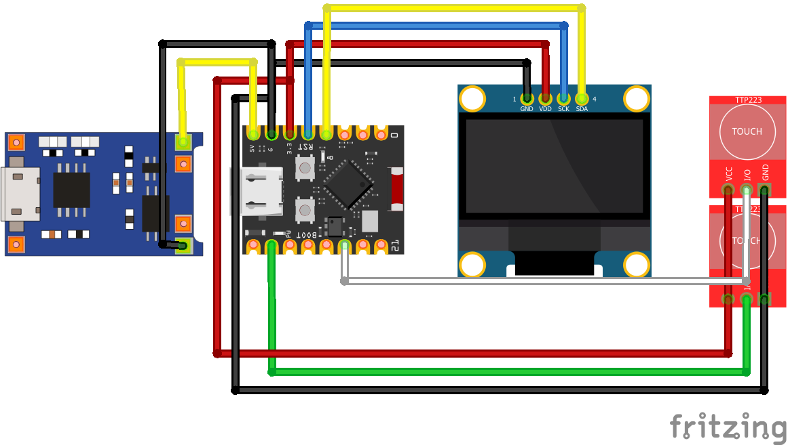

# Rien Index Beeper Device

A physical device aiming to recreate the pager/beeper device Rien used to receive prescripts from Limbus Company Canto 9.

The main goal for this project was to make a budget Index proxy / Rien device. This runs on Web BLE (so it connects directly to your browser without needing weird wifi html setups). This project is under the MIT license so you are free to do anything with it (this includes selling these stuff) but don't try to gatekeep lol. Also, if you decide to make this, feel free to show me! I wanna see it. Hit up @quantdrent on TikTok, Twitter, and Discord.

> **Note:** some knowledge of soldering is needed.

**You need to use a browser that supports Web BLE** (Chrome, Edge, Opera, etc)
https://quantdrent.github.io/Rien-Prescript-Beeper

## Versions & Required Materials
There are two firmwares you can flash depending on what hardware you want to buy. The **nRF52840** is the "Main" version with a full color screen, custom proportional fonts, and deep sleep. The **ESP32** is the "Legacy Lite" version with a basic monochrome OLED (legacy version also doesnt have custom font because im lazy (probably gona add this later)).

> The ESP32 legacy version is kept in this repository because the parts (the ESP32C3 SuperMini and the 1.3" OLED) are generally much cheaper and significantly easier to buy than the 2.25" ST7789 screen. If you are on a strict budget or the main build parts arent available in ur place then use the legacy build

### Main Build (nRF52840)
* SuperMini nRF52840 [[AliExpress](https://www.aliexpress.com/item/1005006019812115.html)]
* 2.25 Inch TFT LCD Module 76x284, ST7789 [[AliExpress](https://www.aliexpress.com/item/1005011855033572.html)]
* 2x Touch capacitive switches TTP-223 [[AliExpress](https://www.aliexpress.com/item/32964219843.html)]
* Any small buttons that can fit inside the case
* Wires (I used AWG 24)

### Legacy Lite Build (ESP32-C3)
* ESP32C3 Super Mini [[AliExpress](https://www.aliexpress.com/item/1005007941259180.html)] (any esp32 supermini should work i think)
* 1.3 Inch OLED Screen SH1106 [[AliExpress](https://www.aliexpress.com/item/1005006862867338.html)]
* 2x Touch capacitive switches TTP-223 [[AliExpress](https://www.aliexpress.com/item/32964219843.html)]
* tp4056 type c charger [[AliExpress](https://www.aliexpress.com/item/1005006043031985.html)]
* any small slide switch that can fit inside the case
* Wires (I used AWG 26)

> Don't forget you need a soldering iron, solder, and maybe some flux to connect them all!

> The Main (nRF52840) and Legacy (ESP32) versions use completely different screens and microcontrollers. The firmware is NOT interchangeable, and the 3D printed cases are completely different sizes Make sure you pick the right firmware and the right 3D model for your parts

## 3D Printing the Case
You need access to a 3D printer to print the case. Check the `models/` folder. 
* **For the Main Build (nRF52840):** Use `rienbeeper.3mf` or `rienbeeper.stl`
* **For the Legacy Lite Build (ESP32):** Use `LegacyESP32Build.3mf` or `LegacyESP32Build.stl`

*(There is also a `tinkercadlink.txt` if you want to remix the case online). I recommend using the `.3mf` files. The best results I got were using a BambuLab A1 (0.4 nozzle) with SUNLU PLA+ 2.0.*

## Instructions

> If you are using a **nRF52840** check out [this guide](https://www.beachyuk.com/blog/connecting-and-testing-promicro-nrf52840-clones) to set up your board. Also, don't forget to solder the boost pads if your battery is more than 500mAh.

> **If you are using a ESP32C3 check out [this guide](https://randomnerdtutorials.com/getting-started-esp32-c3-super-mini/)

1. Click the `<> Code` button and download the ZIP, or clone the repo.
2. Solder everything together based on the pins defined in your firmware's `config.h` file or look at the images section for wiring. (If you are using the 1.3 OLED, you need to desolder the screen from its default pins, good luck).
3. Open the `firmware/` folder, pick your microcontroller, and open the `.ino` file in the Arduino IDE. 
4. Upload the sketch.
5. Open the [Web App](https://quantdrent.github.io/Rien-Prescript-Beeper) on your browser or open the html file to use offline.
6. Click Pair and connect to your device!
7. Click "Prescripts" at the top middle to add/remove your saved prescripts (you can export/import them too, follow the template by exporting first).
8. Click the giant button on the web app to send a random prescript, or just physically tap the buttons on your device to pull one up.
9. You can factory reset by pressing the red button on the bottom right of the settings menu.

## Images

  
  

## Credits
This project and the Web BLE page were inspired by and forked from Kritzkingvoid's Prescript web project.
https://kritzkingvoid.github.io/Prescripts/
