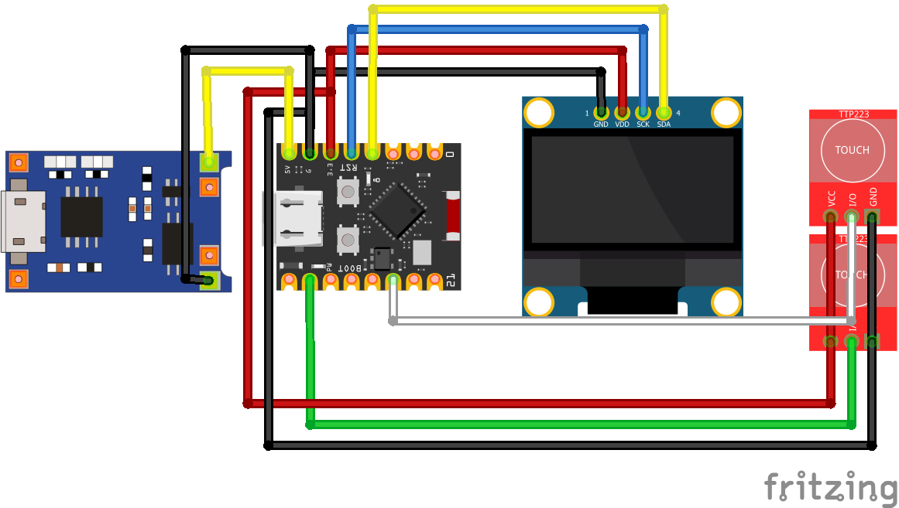

<strong>Rien Index Beeper Device.</strong>

  

The main goal for this project was to make a budget Index Oracle's proxy / Rien device. This runs on Web BLE (so it connects directly to your browser without needing weird setups). This project is under the MIT license so you are free to do anything with it (this includes selling this stuff) but don't try to gatekeep lol. Also, if you decide to make this, feel free to show me! I wanna see it. Hit up @quantdrent on TikTok, Twitter, and Discord.
  
If you want to use the beeper, <a href="https://quantdrent.github.io/Rien-Prescript-Beeper">visit the Web App</a>. or open the html from source code 
<strong>Note: You need to use a browser that supports Web BLE</strong> (Chrome, Edge, Opera, etc).

---

## Hardware Versions & Required Materials

> **READ THIS BEFORE BUYING PARTS**
> 
> There are two completely different versions of this project
> * **The nRF52840 is the ADVANCED build.** It has a tft screen, custom fonts (similar to the web), and deep sleep mode. This is the version you see in the GIF
> * **The ESP32C3 is the LEGACY build.** It has a basic blue OLED screen. It only exists as a cheaper alternative because the parts are easier to buy.
> 
> **DO NOT mix the parts (if you dont know what youre doing).** The firmwares and 3D printed cases are **NOT** interchangeable. The ESP32C3 is **NOT** the advanced version. Make sure you pick the right firmware and 3D model for your parts
>
>if someone makes a esp32c3/s3 version of the advanecd version please tell me and we can put it here

<strong>Advanced Build (nRF52840)</strong>

This is the recommended "Advanced" version with a tft color screen, custom proportional fonts, and deep sleep support.

> **Note:** Don't forget to solder the boost pads on the SuperMini board if your battery is more than 500mAh.

**Required Parts:**
- SuperMini nRF52840 [[AliExpress](https://www.aliexpress.com/item/1005006019812115.html)]
- 2.25 Inch TFT LCD Module 76x284 ST7789 [[AliExpress](https://www.aliexpress.com/item/1005011855033572.html)]
- 2x Touch capacitive switches TTP-223 [[AliExpress](https://www.aliexpress.com/item/32964219843.html)]
- Any small buttons that can fit inside the case
- Wires (AWG 24 recommended)
**3D Printing (Case):**
- **For the Advanced Build (nRF52840 Supermini):** Use `models/Advanced-Case.3mf` or `models/Advanced-Case.stl`
- *(Tinkercad remix link available in `models/tinkercadlink.txt`. I recommend using `.3mf` files. Best results were on a BambuLab A1 with 0.4 nozzle and SUNLU PLA+ 2.0)*

**Wiring Diagram:**

  

#### Board Setup (Arduino IDE)
1. Open Arduino v2.x IDE.
2. Go to **File > Preferences**.
3. Click the icon on the right-hand side of “Additional boards manager URLs”.
4. Add the following URL lines into the text box and click OK:
   * **Temporary fix (use this for now):**
     `https://files.seeedstudio.com/arduino/package_seeeduino_boards_index.json`
     `https://raw.githubusercontent.com/pdcook/nRFMicro-Arduino-Core/3dab6477754d9b28053fe36b06c718cde6e93d3f/package_nRFMicro_index.json`
   * *(Note: The official URL without the hash currently has issues, use the temporary fix).*
5. Go to the Boards Manager (**Tools > Board > Boards Manager**).
6. Search for “nrfmicro”.
7. Find the “nRFMicro-like-Boards” by pdcook, and click “Install”.
8. Go to **Tools > Board > nRFMicro-like-Boards > “SuperMini nRF52840”** (Restart Arduino IDE if it is not listed).
9. Plug in your board to a USB port, click the board selector, and choose the relevant port.

#### Updating the Bootloader
The SuperMini nRF52840 boards have nice!nano v2 compatibility, meaning the Adafruit nRF52 Bootloader can be easily updated.

1. Open your file explorer and look for a USB drive related to your board, often called “NICENANO” (if it isn’t visible, quickly ground the RST pin twice to enter bootloader mode).
2. Inside, `INFO_UF2.TXT` is a small text file that states the current bootloader version.
3. You can see the latest bootloader version on the [bootloader github releases page](https://github.com/adafruit/Adafruit_nRF52_Bootloader/releases).
4. **To update via Arduino IDE:**
   * Go to **Tools > Programmer**, and select **“Bootloader DFU for Bluefruit nRF52”**.
   * Go to **Tools > Burn Bootloader**.
   * **Be patient whilst the bootloader is updated. It is critical not to disconnect mid-update, as you could brick the board.**
5. Once updated, recheck the `INFO_UF2.TXT` file to ensure the version has updated (e.g., from 0.6.0 to 0.9.2).

<strong>Legacy Build (ESP32)</strong>

This legacy version is kept here because the parts are generally much cheaper and significantly easier to source than the 2.25" ST7789 screen. If you are on a strict budget or the advanced parts aren't available in your area, use this build.

> **If you are using a ESP32C3** check out [this guide](https://randomnerdtutorials.com/getting-started-esp32-c3-super-mini/) to set up your board.

**Required Parts:**
- ESP32C3 Super Mini [[AliExpress](https://www.aliexpress.com/item/1005007941259180.html)] (any ESP32 Super Mini should work)
- 1.3 Inch OLED Screen SH1106 [[AliExpress](https://www.aliexpress.com/item/1005006862867338.html)]
- 2x Touch capacitive switches TTP-223 [[AliExpress](https://www.aliexpress.com/item/32964219843.html)]
- TP4056 Type-C Charger [[AliExpress](https://www.aliexpress.com/item/1005006043031985.html)]
- Any small slide switch that fits inside the case
- Wires (AWG 26 recommended)
**3D Printing (Case):**
- **For the Legacy Build (ESP32-C3 Supemini):** Use `models/Legacy-Case.3mf` or `models/Legacy-Case.stl`
- I recommend using `.3mf` files. Best results were on a BambuLab A1 with 0.4 nozzle and SUNLU PLA+ 2.0)*

**Wiring Diagram:**

  

## Quickstart

### Instructions

> **Note:** some knowledge of soldering is needed. Don't forget you need a soldering iron, solder, and maybe some flux to connect them all

1. Click the `<> Code` button and download the ZIP, or check releases.
2. Open the `firmware/` folder, select your microcontroller's folder, and open the `.ino` file in the Arduino IDE.
3. Solder everything together based on the pins defined in your firmware's `config.h` file or refer to the hardware sections above for wiring diagrams. 
4. Upload the sketch to your board.
5. Open the [Web App](https://quantdrent.github.io/Rien-Prescript-Beeper) in your browser (or open the local `index.html` file to use offline).
6. Click **Pair Device** and connect to your beeper and your device should work now.
7. Click **Prescripts** at the top middle to add or remove your saved prescripts. You can also export/import them (export first to see the formatting template).
8. Click the giant button on the web app to send a random prescript, or physically tap the capacitive buttons on your device to pull one up.
9. You can factory reset the device by pressing the red button at the bottom right of the settings menu.

## Credits
This project and the Web BLE page were inspired by and forked from Kritzkingvoid's Prescript web project.
https://kritzkingvoid.github.io/Prescripts/

Sounds were taken from Limbus Company / Project Moon.